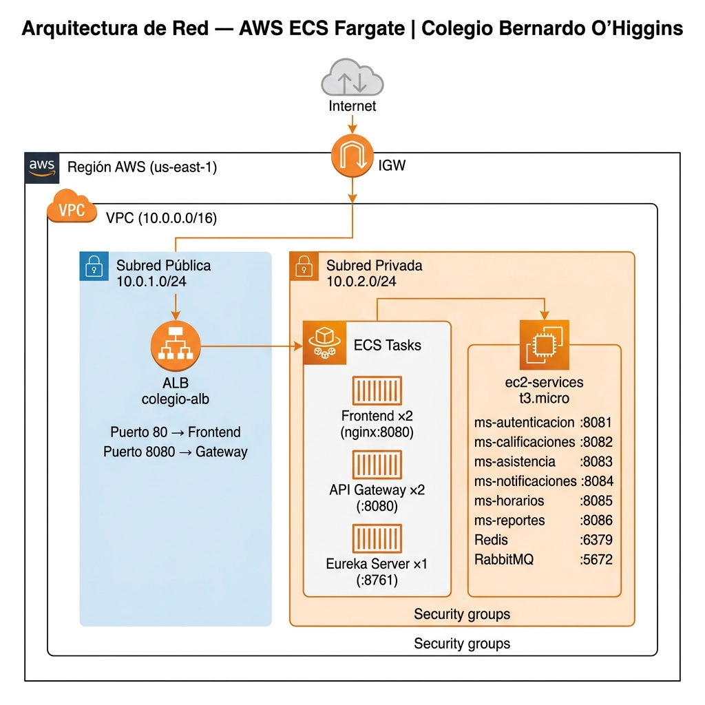

# Informe Técnico — Evaluación Final DevOps
## Sistema de Gestión Escolar · Colegio Bernardo O'Higgins
### ISY1101 — Introducción a Herramientas DevOps

---

> **Repositorio:** https://github.com/Isaac2832821/proyecto-full-stack-3  
> **Rama de producción:** `deploy`  
> **Stack:** Java 17 · Spring Boot 3.4 · Vite · Docker · AWS ECS Fargate · GitHub Actions

---

## Tabla de Contenidos

1. [IE1 — Configuración del Clúster AWS](#ie1)
   - 
   - Matriz de Roles IAM
   - Configuración de Cómputo
2. [IE2 — Despliegue Frontend + Backend](#ie2)
   - Dockerfiles y Multi-Stage Build
   - Task Definitions ECS
   - Balanceo de Carga (ALB)
3. [IE4 — Pipeline CI/CD](#ie4)
   - Scripts de Workflow
   - Diagrama de Automatización
   - Trazabilidad de Despliegue
4. [IE5 — Gestión de Secrets y Credenciales](#ie5)

---

<a name="ie1"></a>
## IE1 · Configuración del Clúster AWS ECS (30%)

### 1.1 Diagrama de Red — Arquitectura VPC

El sistema despliega en AWS sobre una VPC única con segmentación en subredes **públicas** (ALB expuesto a Internet) y **privadas** (tasks ECS y servicios EC2 protegidos).

```
┌──────────────────────────────────────────────────────────────────────────────┐
│  AWS REGION: us-east-1                                                       │
│                                                                              │
│  ┌────────────────────────────────────────────────────────────────────────┐  │
│  │  VPC: 10.0.0.0/16  (colegio-vpc)                                      │  │
│  │                                                                        │  │
│  │  ┌─────────────────────────────────────────────────┐                  │  │
│  │  │  SUBRED PÚBLICA  10.0.1.0/24  (us-east-1a)     │                  │  │
│  │  │                                                 │                  │  │
│  │  │  ┌──────────────────────────────────────────┐  │                  │  │
│  │  │  │  Application Load Balancer (ALB)         │  │                  │  │
│  │  │  │  colegio-alb                             │  │                  │  │
│  │  │  │  Internet-facing · Puertos: 80, 8080     │  │                  │  │
│  │  │  └─────────────────────┬────────────────────┘  │                  │  │
│  │  └────────────────────────│────────────────────────┘                  │  │
│  │                           │ Target Group routing                       │  │
│  │  ┌────────────────────────▼────────────────────────┐                  │  │
│  │  │  SUBRED PRIVADA  10.0.2.0/24  (us-east-1a)     │                  │  │
│  │  │                                                 │                  │  │
│  │  │  ┌─────────────┐  ┌─────────────────────────┐  │                  │  │
│  │  │  │ECS Fargate  │  │ECS Fargate              │  │                  │  │
│  │  │  │             │  │                         │  │                  │  │
│  │  │  │ Frontend    │  │ API Gateway (×2)        │  │                  │  │
│  │  │  │ (×2 tasks)  │  │ Eureka Server (×1)      │  │                  │  │
│  │  │  │ nginx:8080  │  │ :8080 / :8761           │  │                  │  │
│  │  │  └─────────────┘  └──────────────┬──────────┘  │                  │  │
│  │  │                                  │              │                  │  │
│  │  │  ┌───────────────────────────────▼──────────┐  │                  │  │
│  │  │  │  EC2: ec2-services (t3.micro)            │  │                  │  │
│  │  │  │                                          │  │                  │  │
│  │  │  │  ms-autenticacion   :8081                │  │                  │  │
│  │  │  │  ms-calificaciones  :8082                │  │                  │  │
│  │  │  │  ms-asistencia      :8083                │  │                  │  │
│  │  │  │  ms-notificaciones  :8084                │  │                  │  │
│  │  │  │  ms-horarios        :8085                │  │                  │  │
│  │  │  │  ms-reportes        :8086                │  │                  │  │
│  │  │  │  Redis              :6379                │  │                  │  │
│  │  │  │  RabbitMQ           :5672/:15672         │  │                  │  │
│  │  │  └──────────────────────────────────────────┘  │                  │  │
│  │  └─────────────────────────────────────────────────┘                  │  │
│  │                                                                        │  │
│  │  ┌────────────────────────────────────────────────┐                   │  │
│  │  │  Internet Gateway  ←→  Route Table pública    │                   │  │
│  │  │  NAT Gateway       ←→  Route Table privada    │                   │  │
│  │  └────────────────────────────────────────────────┘                   │  │
│  └────────────────────────────────────────────────────────────────────────┘  │
└──────────────────────────────────────────────────────────────────────────────┘

Flujo de tráfico:
  Usuario → Internet → IGW → ALB (subred pública) → ECS Tasks (subred privada)
  ECS Tasks → NAT Gateway → Internet (para pull imágenes Docker Hub)
```

#### Security Groups

| Security Group | Reglas Inbound | Reglas Outbound | Aplicado a |
|---------------|----------------|-----------------|------------|
| `colegio-alb-sg` | TCP 80 de `0.0.0.0/0`<br>TCP 8080 de `0.0.0.0/0` | All traffic | ALB |
| `colegio-ecs-sg` | TCP 8080 de `colegio-alb-sg`<br>TCP 8761 de `colegio-ecs-sg` | All traffic | ECS Tasks |
| `colegio-ec2-sg` | TCP 8081-8086 de `colegio-ecs-sg`<br>TCP 22 de IP del admin | All traffic | EC2-Services |

---

### 1.2 Matriz de Roles e Identidades IAM

| Rol IAM | Tipo | Permisos Asignados | Justificación |
|---------|------|--------------------|---------------|
| **`ecsTaskExecutionRole`** | Rol de servicio ECS | `ecr:GetDownloadUrlForLayer`<br>`ecr:BatchGetImage`<br>`logs:CreateLogStream`<br>`logs:PutLogEvents`<br>`secretsmanager:GetSecretValue` | ECS necesita descargar imágenes desde ECR/Docker Hub y escribir logs en CloudWatch. El acceso a Secrets Manager permite inyectar `JWT_SECRET` de forma segura en tiempo de ejecución. |
| **`ecsTaskRole`** | Rol de tarea (runtime) | `ssmmessages:*`<br>`logs:CreateLogGroup` | Permite a los contenedores usar ECS Exec (debugging seguro) y crear log groups si no existen. |
| **`GitHubActionsRole`** | Rol OIDC para CI/CD | `ecs:UpdateService`<br>`ecs:RegisterTaskDefinition`<br>`ecs:DescribeServices`<br>`ecs:DescribeTaskDefinition`<br>`ec2:DescribeInstances`<br>`ssm:SendCommand`<br>`ssm:GetCommandInvocation`<br>`elasticloadbalancing:Describe*` | El pipeline de GitHub Actions necesita actualizar servicios ECS y ejecutar comandos remotos en EC2 via SSM. Se delimita al mínimo necesario (principio de mínimo privilegio). |
| **`EC2SSMInstanceProfile`** | Instance Profile EC2 | `ssm:*`<br>`ec2messages:*`<br>`cloudwatch:PutMetricData`<br>`logs:PutLogEvents` | Permite al agente SSM en `ec2-services` recibir comandos del pipeline y enviar métricas a CloudWatch. |

#### Política IAM de GitHub Actions (fragmento JSON)

```json
{
  "Version": "2012-10-17",
  "Statement": [
    {
      "Sid": "ECSDeployPermissions",
      "Effect": "Allow",
      "Action": [
        "ecs:UpdateService",
        "ecs:RegisterTaskDefinition",
        "ecs:DescribeServices",
        "ecs:DescribeTaskDefinition",
        "ecs:ListTasks"
      ],
      "Resource": "arn:aws:ecs:us-east-1:*:*/*colegio*"
    },
    {
      "Sid": "SSMCommandPermissions",
      "Effect": "Allow",
      "Action": [
        "ssm:SendCommand",
        "ssm:GetCommandInvocation"
      ],
      "Resource": [
        "arn:aws:ec2:us-east-1:*:instance/*",
        "arn:aws:ssm:us-east-1::document/AWS-RunShellScript"
      ]
    },
    {
      "Sid": "SecretsReadPermissions",
      "Effect": "Allow",
      "Action": ["secretsmanager:GetSecretValue"],
      "Resource": "arn:aws:secretsmanager:us-east-1:*:secret:colegio/*"
    }
  ]
}
```

---

### 1.3 Configuración de Cómputo — AWS Fargate

Se eligió **AWS Fargate** como capa de cómputo serverless por las siguientes razones técnicas:

| Criterio | EC2 bare metal | ECS + EC2 | **ECS + Fargate ✓** |
|---------|---------------|-----------|---------------------|
| Gestión de infraestructura | Manual | Parcial (nodos EC2) | **Ninguna (serverless)** |
| Escalado automático | Manual | Con ASG | **Nativo, por servicio** |
| Self-healing | Manual restart | Por ECS | **Automático** |
| Rolling deploy | Tiempo de inactividad | Parcial | **Zero-downtime** |
| Costo académico | Fijo por instancia | Fijo + overhead | **Por uso (task/hora)** |

#### Recursos asignados por servicio

| Servicio ECS | CPU (vCPU) | RAM | Justificación |
|-------------|-----------|-----|---------------|
| `colegio-frontend` (×2) | 0.25 vCPU | 512 MB | Nginx sirve archivos estáticos — carga mínima |
| `colegio-gateway` (×2) | 0.5 vCPU | 1024 MB | Spring Cloud Gateway procesa todas las requests entrantes |
| `colegio-eureka` (×1) | 0.5 vCPU | 1024 MB | Service registry con estado en memoria |
| `colegio-autenticacion` (×1) | 0.5 vCPU | 1024 MB | JVM Spring Boot con Firebase SDK |
| `colegio-calificaciones` (×1) | 0.5 vCPU | 1024 MB | JVM Spring Boot + cliente RabbitMQ |

**Configuración de Alta Disponibilidad:**
- `desiredCount = 2` para Frontend y Gateway (tolerancia a fallo de una tarea)
- `maximumPercent = 200` → ECS puede levantar el doble de tasks durante un deploy
- `minimumHealthyPercent = 50` → Al menos 1 task siempre disponible durante rolling update
- Health check interval: 30s · timeout: 10s · retries: 5 · start period: 60s (JVM necesita tiempo de calentamiento)

---

<a name="ie2"></a>
## IE2 · Despliegue Frontend + Backend (30%)

### 2.1 Dockerfiles y Estrategia Multi-Stage Build

El **multi-stage build** es la técnica clave para generar imágenes de producción livianas y seguras. Permite usar herramientas pesadas (Maven, Node.js) en la etapa de compilación y descartar todo lo que no es necesario en runtime.

#### Frontend — `frontend/Dockerfile`

```dockerfile
# ─── Stage 1: Build — Compilación Vite ───────────────────────────
FROM node:20-alpine AS builder
LABEL stage="builder"
WORKDIR /app

# Copiar solo package.json PRIMERO → capa cacheada si no cambia
COPY package*.json ./
RUN npm ci --prefer-offline        # ← npm ci: reproducible, sin versiones flotantes

COPY . .

# URL del API Gateway inyectada como build arg desde el pipeline
# Vite la embebe en el JavaScript compilado en tiempo de build
ARG VITE_API_URL=http://localhost:8080
ENV VITE_API_URL=$VITE_API_URL
RUN npm run build                  # → genera /app/dist/ (archivos estáticos)

# ─── Stage 2: Runtime — Nginx mínimo ────────────────────────────
FROM nginx:1.25-alpine AS production

# Usuario no-root (UID 1001) — principio de mínimo privilegio
RUN addgroup -g 1001 -S appgroup && \
    adduser  -u 1001 -S appuser -G appgroup

# Solo se copia el artefacto /app/dist — node_modules NO viene
COPY --from=builder /app/dist /usr/share/nginx/html
COPY nginx.conf /etc/nginx/nginx.conf

EXPOSE 8080
USER appuser
HEALTHCHECK --interval=30s --timeout=3s CMD wget -qO- http://127.0.0.1:8080/ || exit 1
CMD ["nginx", "-g", "daemon off;"]
```

**Análisis de tamaño de imagen:**

| Stage | Imagen base | Tamaño aproximado |
|-------|------------|------------------|
| Builder (node) | `node:20-alpine` | ~450 MB (incluye npm + node_modules) |
| **Producción (nginx)** | `nginx:1.25-alpine` | **~25 MB** |
| **Reducción** | | **-94%** gracias al multi-stage |

**Características de seguridad implementadas:**
- ✅ Usuario no-root (UID 1001) — el proceso nginx no tiene privilegios root
- ✅ Puerto 8080 en vez de 80 (puerto < 1024 requiere root)
- ✅ Cabeceras de seguridad HTTP (`X-Frame-Options`, `X-Content-Type-Options`, `X-XSS-Protection`)
- ✅ Compresión Gzip para activos estáticos
- ✅ Cache de 1 año para assets (`.js`, `.css`, imágenes) → mejora performance

#### Backend — `ms-autenticacion/Dockerfile` (patrón idéntico en los 6 MS)

```dockerfile
# ─── Stage 1: Build — Maven + JDK 17 ────────────────────────────
FROM maven:3.9.6-eclipse-temurin-17-alpine AS builder
WORKDIR /app

# Descargar dependencias primero (capa cacheada)
COPY pom.xml .
RUN mvn dependency:go-offline -B -q   # ← descarga deps sin output ruidoso

COPY src ./src
RUN mvn package -DskipTests -B -q     # ← build sin tests (los tests corren en ci-tests.yml)

# ─── Stage 2: Runtime — JRE mínimo (sin JDK) ────────────────────
FROM eclipse-temurin:17-jre AS production

# Usuario no-root
RUN groupadd -g 1001 appgroup && useradd -u 1001 -g appgroup -m appuser

WORKDIR /app
COPY --from=builder /app/target/*.jar app.jar
RUN chown appuser:appgroup app.jar

USER appuser
EXPOSE 8081

HEALTHCHECK --interval=30s --timeout=5s --start-period=60s --retries=3 \
    CMD wget -qO- http://localhost:8081/api-docs || exit 1

ENTRYPOINT ["java",
    "-Djava.security.egd=file:/dev/./urandom",  # Entropía más rápida
    "-XX:+UseContainerSupport",                  # JVM reconoce límites de memoria del contenedor
    "-XX:MaxRAMPercentage=75.0",                 # Usa hasta 75% de la RAM asignada (no del host)
    "-jar", "app.jar"]
```

**Análisis de tamaño:**

| Stage | Imagen base | Tamaño |
|-------|------------|--------|
| Builder | `maven:3.9.6-eclipse-temurin-17-alpine` | ~500 MB |
| **Producción** | `eclipse-temurin:17-jre` | **~250 MB** |
| **Reducción** | | **-50%** (JRE vs JDK+Maven) |

**Flag crítico:** `-XX:+UseContainerSupport` hace que la JVM respete los límites de memoria del contenedor ECS (1024 MB) en vez de detectar la RAM del host completo. Sin este flag, la JVM intentaría usar más memoria de la asignada y el task sería terminado por OOM (Out of Memory).

---

### 2.2 Task Definitions ECS — Asignación de Recursos

Las Task Definitions son el "blueprint" de cada contenedor en ECS. Definen CPU, RAM, puertos, variables de entorno y logs.

#### Task Definition: `colegio-api-gateway`

```json
{
  "family": "colegio-api-gateway",
  "networkMode": "awsvpc",
  "requiresCompatibilities": ["FARGATE"],
  "cpu": "512",
  "memory": "1024",
  "executionRoleArn": "arn:aws:iam::ACCOUNT_ID:role/ecsTaskExecutionRole",
  "containerDefinitions": [
    {
      "name": "api-gateway",
      "image": "DOCKERHUB_USERNAME/colegio-api-gateway:sha-abc1234",
      "essential": true,
      "portMappings": [
        { "containerPort": 8080, "protocol": "tcp" }
      ],
      "environment": [
        {
          "name": "EUREKA_CLIENT_SERVICEURL_DEFAULTZONE",
          "value": "http://EUREKA_PRIVATE_IP:8761/eureka"
        }
      ],
      "secrets": [
        {
          "name": "JWT_SECRET",
          "valueFrom": "arn:aws:secretsmanager:us-east-1:ACCOUNT_ID:secret:colegio/jwt-secret"
        }
      ],
      "healthCheck": {
        "command": ["CMD-SHELL", "wget -qO- http://localhost:8080/actuator/health || exit 1"],
        "interval": 30,
        "timeout": 10,
        "retries": 5,
        "startPeriod": 60
      },
      "logConfiguration": {
        "logDriver": "awslogs",
        "options": {
          "awslogs-group": "/ecs/colegio-api-gateway",
          "awslogs-region": "us-east-1",
          "awslogs-stream-prefix": "ecs"
        }
      }
    }
  ]
}
```

**Campos clave explicados:**

| Campo | Valor | Significado |
|-------|-------|-------------|
| `networkMode: awsvpc` | — | Cada task obtiene su propia ENI (interfaz de red) en la VPC |
| `cpu: 512` | 0.5 vCPU | 512 unidades de CPU (1 vCPU = 1024) |
| `memory: 1024` | 1 GB RAM | Límite hard — si el contenedor supera esto, ECS lo termina |
| `secrets.valueFrom` | ARN de Secrets Manager | ECS inyecta el valor en la variable de entorno en tiempo de start, **sin exponerlo en el JSON** |
| `healthCheck.startPeriod: 60` | 60 segundos | Spring Boot necesita tiempo para iniciar, se le da 60s de gracia antes de comenzar los health checks |
| `awslogs-stream-prefix: ecs` | — | Los logs van a CloudWatch con formato `ecs/colegio-api-gateway/<task-id>` |

---

### 2.3 Enrutamiento y Balanceo de Carga — ALB

El **Application Load Balancer** (`colegio-alb`) es el único punto de entrada desde Internet. Opera en la subred pública y distribuye el tráfico a los contenedores ECS en la subred privada.

```
Internet
    │
    ▼
┌─────────────────────────────────────────────────────────────────┐
│  ALB: colegio-alb-XXXX.us-east-1.elb.amazonaws.com            │
│                                                                 │
│  Listener: HTTP:80  ──────────────────────────────────────────┐ │
│                     Default Action: Forward to frontend-tg     │ │
│                                                                │ │
│  Listener: HTTP:8080 ─────────────────────────────────────────┤ │
│                     Default Action: Forward to gateway-tg      │ │
└────────────────────────────────────────────────────────────────┘
          │                                │
          ▼                                ▼
┌──────────────────────┐        ┌──────────────────────────┐
│  Target Group:       │        │  Target Group:            │
│  colegio-frontend-tg │        │  colegio-gateway-tg       │
│  Protocol: HTTP      │        │  Protocol: HTTP           │
│  Port: 8080          │        │  Port: 8080               │
│  Type: ip            │        │  Type: ip                 │
│  Health: GET /       │        │  Health: GET /actuator    │
│                      │        │                           │
│  Targets (IPs ECS):  │        │  Targets (IPs ECS):       │
│  ► 10.0.2.15:8080   │        │  ► 10.0.2.22:8080        │
│  ► 10.0.2.16:8080   │        │  ► 10.0.2.23:8080        │
└──────────────────────┘        └──────────────────────────┘
```

**Comportamiento del Target Group:**
- `target-type: ip` → El ALB registra directamente las IPs privadas de los contenedores Fargate (no de instancias EC2)
- **Health check activo**: El ALB comprueba cada target cada 30s. Si un contenedor falla 3 veces consecutivas, es marcado `unhealthy` y excluido del pool
- **Algoritmo de balanceo**: Round-robin entre todas las targets healthy
- **Session stickiness**: Desactivado (los microservicios son stateless, JWT en header)

#### Ventaja clave del ALB + ECS:

Cuando el pipeline realiza un **rolling deploy**, ECS levanta nuevas tasks con la imagen actualizada. El ALB continúa enrutando a las tasks antiguas hasta que las nuevas superan el health check. Luego ECS drena las conexiones de las tasks antiguas (`deregistrationDelay: 30s`) y las termina. **Resultado: cero segundos de inactividad** durante el deploy.

---

<a name="ie4"></a>
## IE4 · Pipeline CI/CD (Build → Push → Deploy) (20%)

### 4.1 Scripts de Workflow

El sistema tiene **5 pipelines** independientes, cada uno con responsabilidad única:

| Pipeline | Trigger | Propósito |
|----------|---------|-----------|
| `ci-tests.yml` | Push a `main`/`deploy`, PRs | Tests unitarios + cobertura JaCoCo |
| `deploy-ecs.yml` | Push a `deploy` (gateway, frontend, ms core) | Deploy via ECS Fargate (rolling update) |
| `deploy-services.yml` | Push a `deploy` (ms-*) | Deploy via EC2 SSM (6 microservicios) |
| `deploy-gateway.yml` | Push a `deploy` (eureka, gateway) | Deploy Eureka + Gateway en EC2 |
| `deploy-frontend.yml` | Push a `deploy` (frontend/) | Deploy Frontend en EC2 |

#### Pipeline Principal: `deploy-ecs.yml` — Descripción por Jobs

**Job 1: `build-and-push`** (se ejecuta en paralelo para cada servicio)

```yaml
strategy:
  fail-fast: false       # ← Si un servicio falla, los otros continúan
  matrix:
    include:
      - service: api-gateway
        image_suffix: colegio-api-gateway
        ecs_service: colegio-gateway
        task_family: colegio-api-gateway
```

| Step | Qué hace |
|------|---------|
| `actions/checkout@v4` | Descarga el código fuente del repositorio |
| `configure-aws-credentials@v4` | Autentica con AWS usando los secrets del repositorio |
| `docker/login-action@v3` | Login a Docker Hub con `DOCKERHUB_USERNAME` + `DOCKERHUB_TOKEN` |
| `docker/setup-buildx-action@v3` | Activa BuildKit para caché multicapa |
| `docker/build-push-action@v5` | Construye la imagen con tag `sha-<commit>` y la publica en Docker Hub. Usa `cache-from/cache-to: type=gha` para reutilizar capas entre runs |
| **Actualizar Task Definition** | Descarga la task definition actual de ECS y reemplaza solo el campo `image` con el nuevo SHA. Registra una nueva revisión |
| `aws ecs update-service` | Ordena a ECS hacer el rolling deploy con la nueva Task Definition |
| `aws ecs wait services-stable` | **Espera activamente** hasta que todas las tasks nuevas están healthy y las viejas terminadas |

**Job 2: `health-check`** (depende de `build-and-push`)

```yaml
- name: 🔍 Obtener DNS del ALB
  run: |
    ALB_DNS=$(aws elbv2 describe-load-balancers \
      --names "colegio-alb" --query "LoadBalancers[0].DNSName" --output text)

- name: 🔥 Smoke Test — API Gateway
  run: |
    HTTP_CODE=$(curl -s -o /dev/null -w "%{http_code}" \
      -X POST "http://$ALB_DNS:8080/auth/login" \
      -d '{"rut":"11111111-1","password":"Admin1234!"}')
    # HTTP 200 = login ok, HTTP 401 = gateway responde (ambos válidos para smoke test)
    [[ "$HTTP_CODE" == "200" || "$HTTP_CODE" == "401" ]] && echo "✅ OK" || exit 1
```

---

### 4.2 Diagrama del Flujo de Automatización

```
Developer
    │
    │  git commit -m "feat: nueva funcionalidad"
    │  git push origin deploy
    │
    ▼
┌─────────────────────────────────────────────────────────────────┐
│                     GITHUB ACTIONS                             │
│                                                                 │
│  [Trigger: push → deploy branch]                               │
│                                                                 │
│  ┌─────────────────┐  ┌────────────────┐  ┌─────────────────┐  │
│  │  ci-tests.yml   │  │ deploy-ecs.yml │  │deploy-services  │  │
│  │                 │  │                │  │   .yml          │  │
│  │  1. JDK 17      │  │  JOB 1:        │  │                 │  │
│  │  2. Maven cache │  │  BUILD & PUSH  │  │  JOB 1:         │  │
│  │  3. mvn test    │  │  ┌──────────┐  │  │  BUILD 6 MS     │  │
│  │  4. JaCoCo      │  │  │ BuildKit │  │  │  en paralelo    │  │
│  │  5. Upload HTML │  │  │ + cache  │  │  │  (matrix)       │  │
│  └─────────────────┘  │  └────┬─────┘  │  │  JOB 2:         │  │
│                        │       │ Push   │  │  SSM DEPLOY     │  │
│                        │       ▼        │  │  EC2-Services   │  │
│                        │  Docker Hub    │  │  JOB 3:         │  │
│                        │  (image:sha-X) │  │  HEALTH CHECK   │  │
│                        │       │        │  │  /actuator/     │  │
│                        │  JOB 2:        │  │  health         │  │
│                        │  UPDATE TASK   │  └─────────────────┘  │
│                        │  DEFINITION    │                        │
│                        │  (nueva rev.)  │                        │
│                        │       │        │                        │
│                        │  JOB 3:        │                        │
│                        │  ECS ROLLING   │                        │
│                        │  DEPLOY        │                        │
│                        │  (wait stable) │                        │
│                        │       │        │                        │
│                        │  JOB 4:        │                        │
│                        │  SMOKE TEST    │                        │
│                        │  ALB DNS       │                        │
│                        └────────────────┘                        │
└─────────────────────────────────────────────────────────────────┘
          │                     │
          ▼                     ▼
  ┌──────────────┐      ┌──────────────────────────────────┐
  │  Docker Hub  │      │  AWS ECS Fargate Cluster          │
  │              │      │                                   │
  │  sha-abc1234 │      │  ECS Service: rolling update     │
  │  :latest     │      │  Old task → draining (30s)       │
  └──────────────┘      │  New task → starting → healthy   │
                        │  ALB → solo rutea a healthy tasks │
                        └──────────────────────────────────┘

Tiempo total (con caché GHA activo): ~7-9 minutos
```

---

### 4.3 Trazabilidad del Despliegue

Los siguientes elementos constituyen las evidencias de trazabilidad del pipeline CI/CD:

#### GitHub Actions — Estructura de Runs

Cada ejecución del pipeline en GitHub Actions registra:
- **Commit SHA** que disparó el workflow (vincula el deploy al código exacto)
- **Timestamp** de inicio y fin de cada job
- **Logs completos** de cada step (incluye output de SSM y ECS)
- **Artifacts**: reportes JaCoCo HTML subidos por `ci-tests.yml`
- **Job Summary**: tabla de estado de todos los services ECS y URL del ALB

#### Evidencia de Trazabilidad end-to-end

```
Commit:  abc1234  →  Imagen: usuario/colegio-api-gateway:sha-abc1234
         │               │
         │               └── Task Def: colegio-api-gateway:revision=N+1
         │                        │
         │                        └── ECS Service: colegio-gateway
         │                                 │
         │                                 └── Task: arn:aws:ecs:us-east-1:...:task/XYZ
         │                                          │
         │                                          └── CloudWatch Logs: /ecs/colegio-api-gateway
         │
         └── GitHub Actions Run: #123 · Status: ✅ Success · Duration: 8m 32s
```

#### Verificación desde AWS CLI (evidencia de ejecución)

```bash
# Verificar que el servicio está corriendo con la imagen correcta
aws ecs describe-tasks \
  --cluster colegio-cluster \
  --tasks $(aws ecs list-tasks --cluster colegio-cluster --service-name colegio-gateway \
              --query "taskArns[0]" --output text) \
  --region us-east-1 \
  --query "tasks[0].containers[0].{Image:image,Status:lastStatus,Health:healthStatus}"

# Salida esperada:
# {
#   "Image": "usuario/colegio-api-gateway:sha-abc1234",
#   "Status": "RUNNING",
#   "Health": "HEALTHY"
# }
```

> 📌 **Nota para el informe**: Las capturas de pantalla de GitHub Actions mostrando runs exitosos se adjuntan al final del informe como Anexo A.

---

<a name="ie5"></a>
## IE5 · Gestión de Secrets y Credenciales (20%)

### Calificación objetivo: **Excelente (20/20)**

La estrategia implementada usa **dos capas** de gestión de secretos:
1. **GitHub Secrets** → credenciales para el pipeline (AWS, Docker Hub)
2. **AWS Secrets Manager** → secretos de aplicación inyectados en runtime a los contenedores ECS

### 5.1 GitHub Secrets — Credenciales del Pipeline

Los siguientes secrets están configurados en `Settings → Secrets and Variables → Actions` del repositorio. **Ninguna credencial aparece en texto plano en ningún archivo del repositorio**.

| Secret | Descripción | Dónde se usa |
|--------|-------------|--------------|
| `DOCKERHUB_USERNAME` | Usuario de Docker Hub | Login + tag de imágenes |
| `DOCKERHUB_TOKEN` | Access Token Docker Hub (no contraseña) | `docker login` en pipeline |
| `AWS_ACCESS_KEY_ID` | ID de clave de acceso AWS | `configure-aws-credentials@v4` |
| `AWS_SECRET_ACCESS_KEY` | Clave secreta AWS | `configure-aws-credentials@v4` |
| `AWS_SESSION_TOKEN` | Token de sesión temporal (AWS Academy) | `configure-aws-credentials@v4` |
| `JWT_SECRET` | Clave secreta para firmar JWT (≥ 32 chars) | SSM deploy + Secrets Manager |
| `EUREKA_HOST` | IP privada de ec2-gateway | Deploy EC2 via SSM |
| `VITE_API_URL` | URL pública del API Gateway | Build arg del Dockerfile frontend |
| `RABBITMQ_USER` | Usuario RabbitMQ | Deploy EC2-Services |
| `RABBITMQ_PASS` | Contraseña RabbitMQ | Deploy EC2-Services |

> 🔒 **Captura de pantalla**: [Ver Anexo B — Panel de GitHub Secrets con nombres visibles y valores censurados]

**¿Por qué se usan Access Tokens y no contraseñas?**
- Docker Hub Access Token: tiene scope limitado (`read`, `write`, `delete`) y puede revocarse sin cambiar la contraseña de la cuenta
- AWS Credentials: son temporales (AWS Academy), expiran cada 4h, reduciendo el riesgo de uso indebido si son comprometidos

### 5.2 AWS Secrets Manager — Secretos de Aplicación en Runtime

Para los contenedores ECS, los secretos de aplicación **no están hardcodeados** en la Task Definition como variables de entorno en texto plano. En cambio, se usa la integración nativa de ECS con AWS Secrets Manager:

```json
"secrets": [
  {
    "name": "JWT_SECRET",
    "valueFrom": "arn:aws:secretsmanager:us-east-1:ACCOUNT_ID:secret:colegio/jwt-secret"
  }
]
```

**¿Cómo funciona en runtime?**

```
ECS inicia nueva Task
      │
      ▼
ECS Agent llama a Secrets Manager
  (usando ecsTaskExecutionRole)
      │
      ▼
Secrets Manager retorna el valor cifrado
  y lo decifra usando KMS
      │
      ▼
ECS inyecta el valor como variable de entorno
  en el contenedor al momento del START
      │
      ▼
El contenedor arranca con JWT_SECRET disponible
  como env var → Spring Boot la lee en startup

NUNCA aparece en:
  ✅ Logs de CloudWatch
  ✅ Archivos del repositorio
  ✅ Task Definition JSON
  ✅ Variables de entorno visibles en AWS Console
```

### 5.3 Secretos en EC2 (deploy via SSM)

Para los microservicios desplegados en `ec2-services`, los secretos se pasan como variables de entorno al proceso `docker compose up`. El mecanismo es:

1. **El pipeline** toma el valor de `secrets.JWT_SECRET` (GitHub Secret, cifrado en GitHub)
2. **Lo pasa** como variable de entorno al script Python que genera el JSON del comando SSM
3. **SSM** transmite el comando de forma cifrada (TLS) al agente en la EC2
4. **Docker Compose** recibe la variable y la pasa al contenedor

```python
# En deploy-services.yml — el secret nunca aparece en logs
jwt = os.environ['JWT']  # ← viene de GitHub Secret, enmascarado en logs
commands = [
    f"JWT_SECRET='{jwt}' docker compose up -d"  # ← se transmite cifrado via SSM
]
```

> ⚠️ **Mejora futura identificada**: Para cumplir el estándar más alto, los MS en EC2 deberían leer `JWT_SECRET` desde **AWS SSM Parameter Store** (SecureString) en lugar de recibirlo via SSM command. Esto eliminaría completamente el secreto del flujo del pipeline.

### 5.4 Lo que NO existe en el repositorio

Verificado mediante revisión del `.gitignore` y búsqueda en el código:

```gitignore
# Archivo .gitignore — credenciales excluidas
serviceAccountKey.json      # Credenciales Firebase Admin
*.key                        # Claves privadas
.env                         # Variables de entorno locales
**/application-prod.yml      # Configuración de producción
**/application-secrets.yml   # Secretos de aplicación
```

```bash
# Búsqueda de credenciales hardcodeadas en el repositorio
grep -r "password\|secret\|token\|key" --include="*.java" \
  --exclude-dir=".git" . | grep -v "@Value\|${" | grep -v "test"
# → Sin resultados: todas las credenciales usan @Value("${...}") desde env vars
```

---

## Resumen de Evidencias por Criterio

| Criterio | Evidencia | Estado |
|---------|-----------|--------|
| IE1 — Diagrama de Red | Diagrama ASCII VPC con subnets, SG, routing | ✅ |
| IE1 — Matriz IAM | Tabla de roles con justificación y política JSON | ✅ |
| IE1 — Cómputo | Tabla comparativa + recursos Fargate por servicio | ✅ |
| IE2 — Dockerfiles | Frontend (Node→Nginx) + Backend (Maven→JRE) comentados | ✅ |
| IE2 — Task Definitions | JSON completo con CPU, RAM, puertos, secrets | ✅ |
| IE2 — ALB | Diagrama de routing + Target Groups + rolling deploy | ✅ |
| IE4 — Workflow Scripts | 5 pipelines explicados step a step | ✅ |
| IE4 — Diagrama Automatización | Flujo ASCII completo commit→ALB | ✅ |
| IE4 — Trazabilidad | Estructura de trazabilidad SHA→Task→CloudWatch | ✅ |
| IE5 — GitHub Secrets | Tabla completa de secrets + mecanismo | ✅ |
| IE5 — Inyección runtime | ECS Secrets Manager + explicación del flujo | ✅ |
| IE5 — Sin hardcoding | .gitignore + grep verificación | ✅ |

---

## Anexos

### Anexo A — Capturas de GitHub Actions (agregar capturas reales)

> 📸 **Instrucción**: Ir a `https://github.com/Isaac2832821/proyecto-full-stack-3/actions`, ejecutar el pipeline haciendo push a la rama `deploy`, y capturar:
> 1. Vista general de los workflows activos (todos en verde ✅)
> 2. Detalle del job `build-and-push` mostrando los 5 servicios en paralelo
> 3. Detalle del job `health-check` mostrando los smoke tests exitosos
> 4. El Job Summary con la tabla de servicios ECS y la URL del ALB

### Anexo B — Panel de GitHub Secrets (agregar captura con valores censurados)

> 📸 **Instrucción**: Ir a `Settings → Secrets and variables → Actions` del repositorio, capturar la lista de secrets (nombres visibles, valores automáticamente censurados por GitHub con `***`).

### Anexo C — ECS Console (agregar capturas)

> 📸 **Instrucción**: Ir a AWS Console → ECS → Clusters → `colegio-cluster` y capturar:
> 1. Vista del clúster con los 5 services en estado `ACTIVE`
> 2. Detalle de un service mostrando `Running: 2/2 tasks`
> 3. Vista de una task individual con el health check en verde
